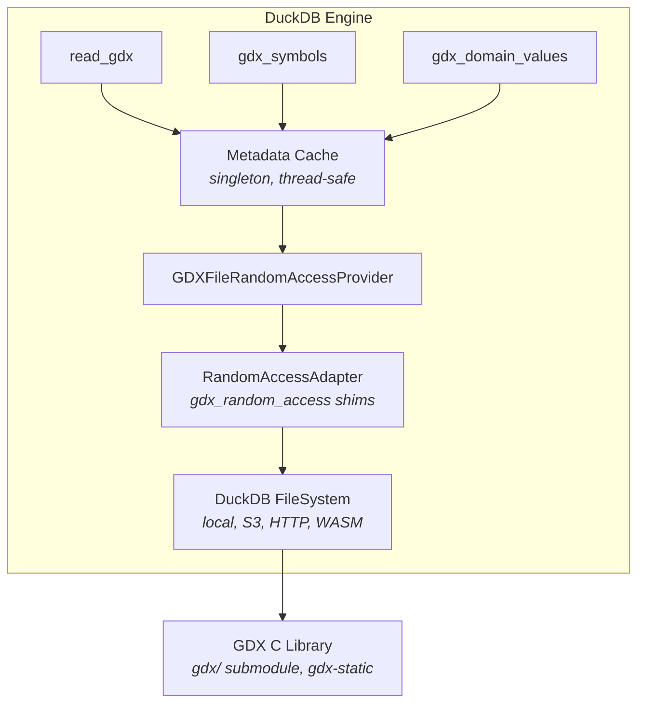

# Architecture

This document describes the internals of the DuckDB GDX extension.

## Overview

The extension registers three table functions (`read_gdx`, `gdx_symbols`, `gdx_domain_values`) and one pragma (`gdx_preload`) with DuckDB. It bundles the [GDX C library](https://github.com/chrispahm/gdx) as a static library and bridges its synchronous random-access I/O model to DuckDB's virtual filesystem, enabling reads from local files, S3, HTTP, and WASM.



## Source files

### Core implementation (`src/`)

| File | Role |
|------|------|
| `gdx_extension.cpp` | Entry point. Registers all functions and the pragma via `LoadInternal`. |
| `gdx_read_function.cpp` | `read_gdx` table function — bind, init, and streaming scan. |
| `gdx_symbols_function.cpp` | `gdx_symbols` table function — returns per-symbol metadata. |
| `gdx_domain_values_function.cpp` | `gdx_domain_values` table function — unique dimension values for UI filters. |
| `gdx_metadata_cache.cpp` | Thread-safe singleton cache of resolved file metadata. |
| `gdx_metadata.cpp` | Reads symbol metadata from a GDX file via the C API. |
| `gdx_file_provider.cpp` | Opens files through DuckDB's FileSystem and creates a `RandomAccessAdapter`. |
| `gdx_random_access_adapter.cpp` | Implements the `gdx_random_access` callback struct that the GDX library requires. |
| `gdx_handle.cpp` | RAII wrapper (`UniqueGDXHandle`) around the GDX C API handle. |
| `gdx_symbol_utils.cpp` | Maps GDX types to DuckDB logical types and builds output schemas. |
| `gdx_error.cpp` | Translates GDX error codes into DuckDB exceptions with context. |
| `gdx_wasm_support.cpp` | WASM-specific HTTP range-request I/O via Emscripten fetch. |
| `gdx_preload_pragma.cpp` | `PRAGMA gdx_preload` — eagerly populates the metadata cache. |
| `gdx_sidecar.cpp` | Optional `.gdxi` JSON sidecar files for offline metadata caching (non-WASM only). |

### Headers (`src/include/gdx/`)

One header per source file, plus `gdx_extension.hpp` for the extension class.

## Extension loading

```cpp
DUCKDB_CPP_EXTENSION_ENTRY(gdx, loader) {
    LoadInternal(loader);  // registers all functions and the pragma
}
```

DuckDB calls this when the extension is loaded via `LOAD gdx` or when linked statically.

## Table function lifecycle

All three table functions follow DuckDB's bind → init → scan pattern:

```
Bind  (single-threaded)   Validate inputs, resolve metadata, build output schema.
  ↓
Init Global               Open file, preload UEL table, start GDX streaming read.
  ↓
Init Local                Per-thread state (currently minimal — MaxThreads = 1).
  ↓
Scan  (called repeatedly) Emit rows into DataChunks until the symbol is exhausted.
```

### `read_gdx` data flow

1. **Bind** — looks up the symbol in the metadata cache (loading from file if needed). Parses optional parameters (`dimension_filters`, `value_columns`, `row_offset`, `row_limit`). Builds the output schema: domain columns (VARCHAR) + optional metadata columns (`is_sparse_break`, `is_dense_run`) + value columns (DOUBLE/BOOLEAN depending on symbol type).

2. **Init Global** — opens the GDX file through the `RandomAccessAdapter`, preloads the entire UEL (Unique Element Label) table into memory for O(1) string lookups, and starts a streaming read via `gdxDataReadRawStart` or `gdxDataReadFilteredStart`.

3. **Scan** — reads one record at a time. Converts raw UEL indices to strings, extracts the requested value columns, maps GDX special values (NA, EPS, +INF, −INF) to NULL, and fills the output vector. Respects offset/limit for pagination.

### `gdx_symbols` data flow

Returns one row per symbol in the file. The scan phase reads directly from the cached metadata — no file I/O during scanning.

### `gdx_domain_values` data flow

Returns unique values for a specific dimension of a symbol. Results are lazily cached in the metadata entry to support cascading filter workflows.

## Random-access adapter

The GDX library requires synchronous, positioned reads via a callback struct:

```c
struct gdx_random_access {
    int (*read_at)(void *user_data, uint64_t offset, void *dst,
                   size_t requested, size_t *out_read);
    int (*get_size)(void *user_data, uint64_t *out_size);
    void (*close)(void *user_data);
};
```

`RandomAccessAdapter` implements these callbacks by delegating to a DuckDB `FileHandle`. This lets GDX read from any filesystem DuckDB supports (local, S3, HTTP) without modification.

## Metadata cache

`GDXMetadataCache` is a global singleton protected by a mutex. It maps resolved file paths to `GDXMetadataEntry` structs containing the symbol list (name, type, dimensions, record count, domain labels) and a per-dimension domain values cache.

The cache avoids reopening files for repeated queries against the same GDX. `PRAGMA gdx_preload` eagerly populates the cache; `force_reload` drops and re-reads a specific file's entry.

On non-WASM builds, optional `.gdxi` sidecar files persist metadata as JSON. Freshness is validated against file size and modification time.

## Schema generation

Output columns depend on the GDX symbol type:

| Symbol type | Domain columns | Value columns |
|-------------|---------------|---------------|
| Set (1D) | `i` | `is_member` (BOOLEAN) |
| Parameter (2D) | `i`, `j` | `value` (DOUBLE) |
| Variable (2D) | `i`, `j` | `level`, `marginal`, `lower`, `upper`, `scale` (DOUBLE) |
| Equation (2D) | `i`, `j` | `level`, `marginal`, `lower`, `upper`, `scale` (DOUBLE) |

Domain column names come from the GDX file's domain labels. Collisions are resolved by appending `_2`, `_3`, etc. Users can restrict value columns with the `value_columns` parameter.

## Dimension filter pushdown

When `dimension_filters => map(['i'], ['seattle'])` is passed, the bind phase registers the filter values as UEL mappings. The GDX library then uses `gdxDataReadFilteredStart` to skip non-matching records at the I/O level, avoiding a full scan.

## WASM support

When compiled with Emscripten:

- `InitializeWasmRandomAccess` provides HTTP range-request callbacks via `emscripten_fetch` for reading remote GDX files directly in the browser.
- Sidecar file support is excluded (no local filesystem).
- `DUCKDB_GDX_NO_WASM_HTTP` disables HTTP fetching for use with DuckDB-WASM's `registerFileBuffer` approach instead.

## Build structure

The extension is built with CMake via the DuckDB extension toolchain:

- The `gdx/` submodule provides the `gdx-static` CMake target (GDX C library + bundled zlib).
- `extension-ci-tools/` provides the DuckDB build integration.
- `EXT_FLAGS` in the Makefile sets C++17 and platform-specific workarounds.
- Supported platforms: Linux amd64, macOS amd64/arm64, Windows amd64, WASM (mvp/eh/threads).

## Key optimizations

- **UEL preloading** — the entire UEL table is read once per file open, enabling O(1) string lookups during scan instead of per-record API calls.
- **Metadata caching** — global singleton prevents repeated file opens for symbol discovery.
- **Streaming reads** — one record at a time with no full-symbol buffering.
- **Filter pushdown** — dimension filters compiled into GDX filter objects before scan.
- **Value column projection** — only requested value columns are extracted.

## Limitations

- **Single-threaded scan** — MaxThreads is 1 per table function invocation.
- **Alias symbols** — rejected at bind time; users must query the target symbol directly.
- **No ENUM types** — domain values are returned as VARCHAR.
